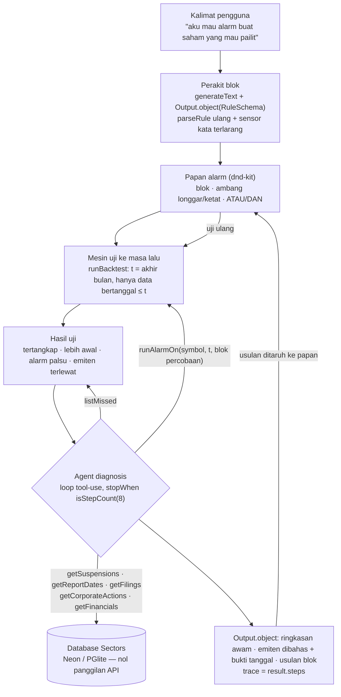
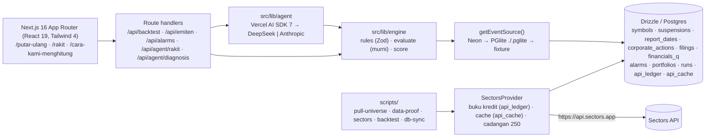

# Alarm Saham

[](https://github.com/fajaraji/alarm-saham/actions/workflows/ci.yml)

Alarm Saham membuat investor biasa bisa melihat tanda bahaya struktural yang sudah diterbitkan bursa tapi tak terbaca — dan membiarkan mereka **merakit sendiri alarmnya, mengujinya ke kasus nyata di masa lalu, lalu memasangnya** untuk menjaga portofolio. Semua data dari [Sectors Financial API](https://sectors.app). Dikerjakan untuk **Sectors Hackathon 2026, track AI Agents & Assistants**.

> **Alarm Saham adalah alat informasi dan analisis, bukan saran investasi.** Tidak ada eksekusi jual-beli, tidak ada rekomendasi, dan tidak ada penilaian tentang emiten mana pun — hanya fakta resmi dengan sumbernya.

## Untuk juri — 60 detik

- **Masalah:** tanda-tanda resmi (suspensi, laporan kuartal yang berhenti, ekuitas negatif, rights issue) sudah dipublikasikan bursa jauh sebelum sebuah saham dihapus, tetapi tidak terbaca oleh investor ritel.
- **Yang dibuat:** (1) *putar ulang* rekaman tanda resmi sebuah emiten, (2) *rakit* alarm dari blok syarat dan **uji ke masa lalu** pada 107 emiten nyata, (3) *pasang* alarm ke portofolio (sedang dikerjakan).
- **Agent:** loop tool-use buatan sendiri (Vercel AI SDK 7) yang menyelidiki **kenapa alarm bolong di emiten tertentu** dengan 7 tool di atas database Sectors, lalu mengusulkan blok — trace tool disusun dari langkah SDK, bukan karangan model. Perakit blok memakai structured output ke skema Zod yang sama dengan mesin uji.
- **Skor nyata (bukan demo palsu):** aturan bawaan menangkap **26/74** emiten kena rata-rata **9 bulan** sebelum kejadian dengan **1/30** alarm palsu — direproduksi oleh `npm run backtest` dan dijaga tes otomatis. Keterbatasannya ditulis jujur di halaman `/cara-kami-menghitung`.
- **Sectors adalah inti:** 463 dari 1.000 kredit dipakai untuk menarik universe uji ke database; tanpa Sectors tidak ada uji ke masa lalu maupun mode pasang.
- **Status:** layar 1–2, mesin uji, agent, lapisan data selesai dan teruji (268 tes unit/integrasi, 11 e2e). Layar 3, cron, dan deploy sedang dikerjakan; blocker: `DATABASE_URL` Neon dan kunci LLM (detail di [Status jujur](#status-jujur)).

## Masalah dan pengguna

Pengguna kami adalah investor ritel yang pernah "nyangkut": membeli karena tip di grup, lalu sahamnya disuspensi berbulan-bulan sampai akhirnya dihapus dari bursa. Pada 10 November 2026 BEI menghapus **18 emiten** sekaligus — 7 karena pailit (COWL, MTRA, SRIL, TOYS, SBAT, TDPM, TELE) dan 11 karena suspensi lebih dari 50 bulan (LCGP, SUGI, MABA, LMAS, SKYB, ENVY, GOLL, PLAS, TRIL, UNIT, DUCK). Untuk hampir semuanya, tanda resminya sudah ada bertahun-tahun sebelumnya di data yang sama yang kini kami tarik dari Sectors. Bagian yang tidak dimiliki BEI, Stockbit, maupun Ajaib adalah **langkah 2: merakit alarm sendiri dan mengujinya ke masa lalu** — itulah inti produk ini.

## Apa yang dibuat — tiga langkah

| Langkah | Halaman | Isi | Status |
|---|---|---|---|
| 1. Putar ulang | `/putar-ulang?kode=SRIL` | Garis waktu tanda resmi satu emiten (suspensi + PDF BEI, kuartal laporan yang hilang, ekuitas negatif, rights issue) dengan slider waktu; setiap kejadian menyebut endpoint sumbernya | selesai, data nyata |
| 2. Rakit alarm | `/rakit` | Papan drag-and-drop (dnd-kit): 5 blok kelas A, ambang longgar/ketat, ATAU/DAN → **Uji ke masa lalu** → skor tertangkap / lebih awal / alarm palsu per emiten → panel AI (perakit dari kalimat, diagnosis "kenapa bolong") | selesai; AI menunggu kunci |
| 3. Pasang & jaga | `/pasang` | Portofolio per tautan rahasia, evaluasi harian kelas A dari DB + kelas B (broker, free float, harga 90 hari) dari Sectors dengan cache 24 jam, notifikasi in-app/Telegram | **sedang dikerjakan** (tiket 11–12) |
| Metodologi | `/cara-kami-menghitung` | Definisi blok & ambang dari konstanta mesin, cara skor dihitung, universe, anti-lookahead, keterbatasan, kredit terpakai, tabel per emiten | selesai |

## Kenapa ini "agent", bukan sekadar prompt

Dua kemampuan AI, keduanya di `src/lib/agent/`, keduanya diuji dengan model tiruan sehingga `npm test` tidak butuh kunci:

1. **Perakit blok** (`rakit.ts`): kalimat awam → `generateText` + `Output.object(RuleSchema)` — skema Zod yang **sama** dengan mesin uji — lalu divalidasi ulang `parseRule` dan disensor kata rekomendasi (beli/jual/hold/target harga). Kalimat di luar domain ditolak sopan.
2. **Agent diagnosis** (`diagnosis.ts`, inti track): diberi aturan + hasil uji, agent menjalankan loop tool-use (`stopWhen: isStepCount(8)`) dan **memutuskan sendiri** tool mana yang dipanggil untuk menjelaskan kenapa alarm tidak berbunyi di emiten tertentu, mencoba blok tambahan lewat mesin uji, lalu mengusulkan maksimal 2 blok. `trace` dibangun dari `result.steps` (tool call sungguhan), bukan dari teks model.



Tool yang tersedia untuk agent (semua membaca `EventSource` yang sama dengan mesin uji, tanpa memanggil Sectors):

| Tool | Fungsi |
|---|---|
| `listMissed` | daftar emiten kena yang alarmnya tidak berbunyi pada hasil uji ini |
| `getSuspensions` | semua kejadian suspensi satu emiten (tanggal + alasan bursa) |
| `getReportDates` | kuartal laporan yang tersedia + kuartal yang hilang sampai tanggal target |
| `getFilings` | filing jual/beli insider & institusi |
| `getCorporateActions` | rights issue: ex-date dan rasio saham baru/lama |
| `getFinancials` | ekuitas total per kuartal |
| `runAlarmOn` | jalankan mesin uji (`fires`) pada satu emiten/tanggal dengan blok percobaan |

Provider LLM dipilih lewat env (`LLM_PROVIDER`): **DeepSeek** (`deepseek-v4-flash`, default, murah dan prabayar) atau **Anthropic** (`claude-opus-5`). Logika agent identik untuk keduanya; opsi khusus Anthropic (adaptive thinking, prompt caching) hanya dipasang saat provider Anthropic. Detail biaya di bagian [Otak AI](#otak-ai-perakit-blok--diagnosis).

## Arsitektur



- **Aplikasi:** Next.js 16.3 (App Router, Turbopack), React 19, TypeScript, Tailwind v4, dnd-kit. Bahasa UI: Indonesia awam.
- **AI:** Vercel AI SDK 7 (`ai`, `@ai-sdk/deepseek`, `@ai-sdk/anthropic`). Tidak ada klien yang dibuat di module scope; tanpa kunci, endpoint AI menjawab 503 dengan pesan yang menyebut kedua opsi.
- **Lapisan data:** satu antarmuka `DataProvider` dengan dua implementasi — `SectorsProvider` (API asli + **buku kredit** setiap panggilan, **cache** permanen untuk data historis / TTL untuk data harian / 30 hari untuk 404, **penolakan otomatis** bila sisa kredit < 250 kecuali `ALLOW_RESERVE=1`) dan `FixtureProvider` (JSON kecil). **Semua uji ke masa lalu berjalan dari database, bukan API.**
- **Database:** Drizzle ORM + Postgres. Produksi: Neon (`DATABASE_URL`). Tanpa `DATABASE_URL`, skrip dan halaman otomatis memakai **PGlite** (Postgres asli via WASM) di `./.pglite` dengan migrasi yang sama — inilah kondisi mesin pengembangan saat ini. `npm run db:sync -- --from=pglite --to=neon` memindahkan semua tabel tanpa kredit.
- **Mesin uji** (`src/lib/engine`): `fires(rule, events, t)` fungsi murni yang hanya melihat baris bertanggal ≤ t; `runBacktest` memindai akhir bulan dan menghasilkan skor deterministik. Asumsi ditulis di `docs/mesin-uji.md`.
- **Keamanan:** kunci hanya di `.env.local` (di-gitignore); pre-commit `scripts/check-secrets.mjs` menolak commit yang memuat pola kunci; kunci tidak pernah dicetak ke log.

## Endpoint Sectors yang dipakai dan alasannya

Kedalaman data tiap endpoint dibuktikan lebih dulu pada 6 emiten (tiket 04, `docs/data-proof.md`) sebelum universe ditarik (tiket 07, `docs/universe-pull.md`). Kredit di kolom terakhir = penarikan universe 107 emiten menurut `api_ledger`; 68 kredit pembuktian data mendahuluinya.

| Endpoint | Dipakai untuk | Kenapa endpoint ini | Kredit (tiket 07) |
|---|---|---|---|
| `/v2/suspensions/` (feed seluruh bursa, `limit=30`, `end` tetap) | blok **saham disuspensi**; tanggal kejadian target semua emiten kena; menyaring kontrol (tanpa suspensi) | satu-satunya sumber *sejarah* suspensi — per simbol hanya mengembalikan 1 baris (suspensi terakhir); 583 kejadian sejak 2018-12-28 | 20 |
| `/v2/company/get_quarterly_financial_dates/{symbol}/` | blok **laporan keuangan hilang/berhenti**; memilih `n_quarters` financials | daftar kuartal yang tersedia sejak 2020 q1; hanya bertambah → bebas lookahead; 1 kredit per emiten | 101 (termasuk 8 × 404) |
| `/v2/company/corporate-actions/{symbol}/` | blok **aksi korporasi dilutif** (rights issue: `ex_date`, `new_ratio/old_ratio`) | satu-satunya sumber rights issue berikut rasio; kedalaman sampai 2016 | 93 |
| `/v2/financials/quarterly/{symbol}/` | blok **utang lebih besar dari harta** (`total_equity < 0`) | data ekuitas per kuartal; **mahal (1 kredit/kuartal)** → hanya 18 emiten delisting, `n_quarters` dari `dates` agar tidak membayar kuartal kosong | 91 |
| `/v2/filings/?symbol=` | blok **orang dalam menjual** (`transaction_type=sell`, `holder_type` insider/institution) | satu-satunya feed transaksi orang dalam; **data mulai 2024**, maka blok ini "kelas A terbatas" | 89 |
| `/v2/companies/?where=indices in ['LQ45']` | memilih 30 kontrol sehat | daftar LQ45 resmi; tidak mengembalikan market cap dan menolak `order_by` → kontrol = 30 pertama alfabetis (dijelaskan di halaman metodologi) | 1 |
| `/v2/free-float/` | nama emiten; blok kelas B **free float kecil** (mode pasang) | snapshot seluruh bursa 1 kredit/100 emiten; tanpa sejarah → tidak ikut uji | 0 (cache 24 jam dari tiket 04) |
| `/v2/broker-summary/{symbol}/`, `/v2/daily/{symbol}/` | blok kelas B **ritel dominan** dan **jatuh dari puncak 90 hari** (mode pasang) | data terkini berjendela 14/90 hari; diuji di tiket 04, dipakai UI oleh tiket 11 | — (30 kredit dianggarkan untuk demo) |
| `/v2/listing-performance/{symbol}/` | *dicoba*, lalu **dihapus** | 404 untuk 5 dari 6 emiten uji dan tanpa tanggal listing; 404 tetap ditagih | — |

## Cara menjalankan

Prasyarat: Node.js 24 dan npm 11. Perintah di bawah **diuji dari clone bersih** (lihat [Verifikasi dari clone bersih](#verifikasi-dari-clone-bersih)).

```bash
git clone https://github.com/fajaraji/alarm-saham.git
cd alarm-saham
npm ci
cp .env.example .env.local     # PowerShell: Copy-Item .env.example .env.local
npm test                       # 268 tes; tanpa kunci, tanpa jaringan
npm run dev                    # http://localhost:3000
```

Tiga tingkat, tergantung apa yang Anda punya:

1. **Tanpa kunci apa pun** — `/putar-ulang`, `/rakit` (uji ke masa lalu dari fixture 8 emiten), dan `/cara-kami-menghitung` (snapshot skor nyata yang di-commit) berjalan. Endpoint `/api/agent/*` menjawab 503 dan UI menampilkan banner "AI belum aktif".
2. **Dengan `SECTORS_API_KEY`** — bangun database lokal PGlite (≈ 405 kredit sekali jalan, idempoten; jalankan `--dry` dulu untuk melihat berapa yang belum ter-cache):
   ```bash
   npm run pull-universe -- --dry --pglite
   npm run pull-universe -- --pglite
   ```
   Setelah itu `/putar-ulang` dan `npm run backtest` memakai 107 emiten nyata. Catatan jujur: tombol "Uji ke masa lalu" di `/rakit` memakai database hanya bila `DATABASE_URL` terisi; tanpa itu ia memakai fixture.
3. **Dengan `DATABASE_URL` (Neon)** — `npm run db:migrate` lalu `npm run db:sync -- --from=pglite --to=neon`; semua halaman dan API memakai Neon. Tambahkan `DEEPSEEK_API_KEY` (atau `ANTHROPIC_API_KEY`) untuk mengaktifkan perakit blok dan agent diagnosis.

Uji end-to-end (Playwright, membangun build production di port 3100; memakai `./.pglite` bila ada, selain itu fixture): `npm run test:e2e`.

## Cara mereproduksi skor

Mesin uji tidak pernah memanggil API — sumbernya `DATABASE_URL`, lalu `./.pglite`, lalu fixture.

```bash
# Contoh kecil 8 emiten (selalu bisa, tanpa data apa pun):
npm run backtest -- src/lib/engine/fixtures/aturan-default.json --fixture --today=2026-09-07
#   → Tertangkap 2/4 (SRIL lead 41 bln, TELE 5 bln), rata-rata 23 bln, alarm palsu 0/4

# Universe nyata 107 emiten (butuh ./.pglite atau DATABASE_URL):
npm run backtest -- src/lib/engine/fixtures/aturan-default.json --today=2026-09-07
#   → Tertangkap 26/74 (delisting 6/18, watchlist 20/56), rata-rata 9 bln, median 7, alarm palsu 1/30

# Snapshot JSON yang di-commit (docs/skor-nyata.json) dihasilkan oleh:
npm run backtest -- src/lib/engine/fixtures/aturan-default.json --today=2026-09-07 --json
```

`tests/unit/docs/skor-nyata.test.ts` menghitung ulang skor dari `./.pglite` dan menuntut ringkasan **dan** rincian per emiten identik dengan snapshot (di-skip dengan pesan bila folder PGlite tidak ada). Aturan lain bisa ditulis sebagai JSON `{ name, combine: "any"|"all", blocks: [{ kind, threshold }] }` dengan `kind` ∈ `suspensi | laporan_hilang | aksi_dilutif | ekuitas_negatif | insider_jual` dan `threshold` ∈ `longgar | ketat`.

## Skor nyata (snapshot 2026-09-07)

Aturan bawaan "Saham mau pailit" = suspensi (longgar) ATAU laporan hilang (longgar) ATAU ekuitas negatif (longgar); pindai akhir bulan 2020-01-31 … 2026-09-07; sumber PGlite hasil tiket 07.

| Ukuran | Nilai |
|---|---|
| Tertangkap (emiten kena) | **26/74** — delisting 6/18, pemantauan khusus 20/56 |
| Lebih awal (kejadian ≥ 2021) | rata-rata **9 bulan**, median 7 |
| Alarm palsu | **1/30** kontrol sehat (AADI — keterbatasan definisi, dijelaskan di halaman metodologi) |
| Dilewati | 3 emiten pemantauan tanpa kejadian target (MENN, TGRA, WSKT) |

Kenapa 12 dari 18 delisting terlewat, universe 18 + 59 + 30, cara memilih kontrol, anti-lookahead, dan keterbatasan (data laporan sejak 2020 q1, filing sejak 2024, 8 emiten 404, suspensi per simbol 1 baris, free float tanpa sejarah, survivorship) ada di **`/cara-kami-menghitung`** dan `docs/data-proof.md` § "Skor nyata pertama".

## Verifikasi dari clone bersih

Dijalankan 7 September 2026 di Windows 11 (Node 24) dari `git clone` lokal ke folder sementara di luar repo, tanpa `.env.local`, tanpa `./.pglite`:

| Perintah | Hasil |
|---|---|
| `npm ci` | exit 0 |
| `npm test` | exit 0 — 268 tes lulus, 33 berkas; tes hitung ulang PGlite di-skip dengan pesan (folder tidak ada) |
| `npm run backtest -- src/lib/engine/fixtures/aturan-default.json --fixture --today=2026-09-07` | exit 0 — 2/4 tertangkap, rata-rata 23 bln, alarm palsu 0/4 |
| `npm run backtest -- src/lib/engine/fixtures/aturan-default.json --today=2026-09-07` | exit 0 — jatuh ke fixture (`DATABASE_URL kosong dan ./.pglite tidak ada`) |

## Status jujur

**Selesai dan teruji** (tiket 02–10): bootstrap + CI; klien Sectors + buku kredit + cache + `FixtureProvider`; pembuktian data; skema DB + migrasi; mesin uji; penarikan universe 107 emiten (395 kredit, run ulang 0); agent diagnosis + perakit (model tiruan); provider DeepSeek/Anthropic; layar 2 papan alarm; layar 1 putar ulang; halaman metodologi + README ini (tiket 14).

**Sedang dikerjakan:** layar 3 pasang & mode jaga (tiket 11), cron harian + notifikasi (tiket 12), panduan/kamus/disclaimer di semua layar (tiket 13), pengerasan & smoke test (tiket 15), deploy production (tiket 16). Bagikan alarm lewat tautan (tiket 17) hanya bila waktu tersisa.

**Blocker yang butuh manusia** (status 7 September 2026, dicek keberadaan nilainya saja):

| Kebutuhan | Status | Dampak |
|---|---|---|
| `DATABASE_URL` Neon | kosong | data universe hanya di PGlite lokal (tidak di-track git); produksi belum punya data — langkah pindah tanpa kredit sudah siap (`db:migrate` → `db:sync`) |
| `DEEPSEEK_API_KEY` / `ANTHROPIC_API_KEY` | kosong | perakit & diagnosis **belum pernah diuji dengan model sungguhan**; semua bukti dari model tiruan |
| `TELEGRAM_BOT_TOKEN` | kosong | aturan cadangan PLAN §7.5: notifikasi in-app jadi jalur utama |
| `vercel login` | belum diverifikasi | sebelum deploy |

Yang **belum** ada dan tidak kami klaim: mode pasang, notifikasi, cron, deploy hidup, uji AI nyata.

## Kepatuhan aturan lomba

- Data Sectors adalah inti: tanpa Sectors tidak ada uji ke masa lalu maupun mode pasang. Setiap panggilan tercatat di buku kredit; 463 dari 1.000 kredit terpakai, 250 cadangan tidak disentuh kode.
- Logika agent buatan sendiri (loop tool-use + structured output di atas mesin uji), bukan sekadar prompt.
- **Tidak ada eksekusi order beli/jual**; tidak ada blok aksi "beli/jual"; agent menolak kata rekomendasi.
- **Bukan saran investasi**: disclaimer di footer setiap layar dan di system prompt agent; emiten nyata hanya disebut dengan fakta resmi + tautan sumber.
- Kunci hanya di `.env.local` (`.gitignore`), pre-commit secret scan, tidak pernah dicetak.
- Repo dibuat setelah onboarding tim; setelah submit, repo dan aplikasi **dibekukan** (tidak ada commit) dan tetap publik ≥ 90 hari.

## Perintah

| Perintah | Keterangan |
|---|---|
| `npm run dev` | server pengembangan |
| `npm run lint` · `npm run typecheck` | ESLint · TypeScript |
| `npm test` | Vitest (unit + integrasi PGlite in-memory) |
| `npm run test:e2e` | Playwright di build production lokal |
| `npm run build` | build produksi |
| `npm run backtest -- <aturan.json> [--fixture] [--pglite[=dir]] [--json] [--today=YYYY-MM-DD]` | uji ke masa lalu dari DB/PGlite/fixture, nol API |
| `npm run pull-universe -- [--dry] [--pglite]` | tarik universe uji ke DB (butuh `SECTORS_API_KEY`; `--dry` = tanpa API) |
| `npm run data-proof -- [--dry]` | pembuktian data 6 emiten (tiket 04) |
| `npm run sectors -- <endpoint> <symbol>` | panggilan tunggal ke Sectors lewat provider (ledger + cache) |
| `npm run db:migrate` · `npm run db:sync -- --from=pglite --to=neon` | migrasi Drizzle · salin PGlite → Neon tanpa kredit |
| `npm run agent:demo -- tele` | diagnosis nyata (butuh kunci LLM, berbiaya) |

## Otak AI (perakit blok & diagnosis)

Fitur AI memakai Vercel AI SDK dan bisa berjalan di salah satu dari dua provider. Cukup isi **satu** kunci di `.env.local`.

| Provider | Variabel kunci | Model bawaan | Catatan |
|---|---|---|---|
| **DeepSeek** (default) | `DEEPSEEK_API_KEY` | `deepseek-v4-flash`; `DEEPSEEK_REASONER=1` → `deepseek-v4-pro` | murah, saldo prabayar, tanpa langganan |
| Anthropic | `ANTHROPIC_API_KEY` | `claude-opus-5` (penalaran), `claude-sonnet-5` (ringan) | butuh akun & kredit Anthropic |

Pemilihan provider: `LLM_PROVIDER=deepseek` atau `anthropic`. Bila kosong, otomatis DeepSeek jika `DEEPSEEK_API_KEY` terisi, kalau tidak Anthropic. Tanpa kunci sama sekali, `/api/agent/*` menjawab 503 dan `npm run agent:demo` berhenti (exit 2). Alias lama `deepseek-chat`/`deepseek-reasoner` dipensiunkan DeepSeek pada 24 Juli 2026 — jangan dipakai.

Cara mendapat kunci DeepSeek: daftar di https://platform.deepseek.com → **Top up** saldo prabayar kecil (US$2–5 cukup untuk ratusan diagnosis) → **API keys** → **Create new API key** → salin ke `.env.local`.

Perkiraan biaya (harga resmi per 1 juta token, dicek 7 September 2026, jam sibuk / jam lengang): `deepseek-v4-flash` input cache hit $0,014 / $0,007, cache miss $0,44 / $0,22, output $1,32 / $0,66; `deepseek-v4-pro` sekitar 3×. Satu diagnosis (maks 8 langkah tool, ≈30 ribu token input + 3 ribu output) ≈ **US$0,02** dengan `v4-flash`; satu perakitan blok di bawah US$0,01. Pemakaian token nyata dikembalikan di field `usage` setiap respons.

## Dokumen

- `PLAN.md` — kontrak rencana (keputusan, blok, cara skor, arsitektur, anggaran kredit, aturan cadangan).
- `docs/data-proof.md` — kedalaman data per endpoint, keputusan blok, skor nyata pertama.
- `docs/universe-pull.md` — penarikan 107 emiten, kredit per langkah, kontrol, jalur ke Neon.
- `docs/mesin-uji.md` — asumsi mesin uji.
- `docs/skor-nyata.json` — snapshot skor yang dijaga tes.
- `docs/decisions.md` — log keputusan bertanggal dan aturan cadangan yang terpicu.
- `tickets/` — status tiap tiket dengan bukti verifikasi.

---

**Alarm Saham adalah alat informasi dan analisis, bukan saran investasi. Tidak ada rekomendasi beli/jual, tidak ada eksekusi transaksi, dan tidak ada penilaian tentang emiten mana pun.**
