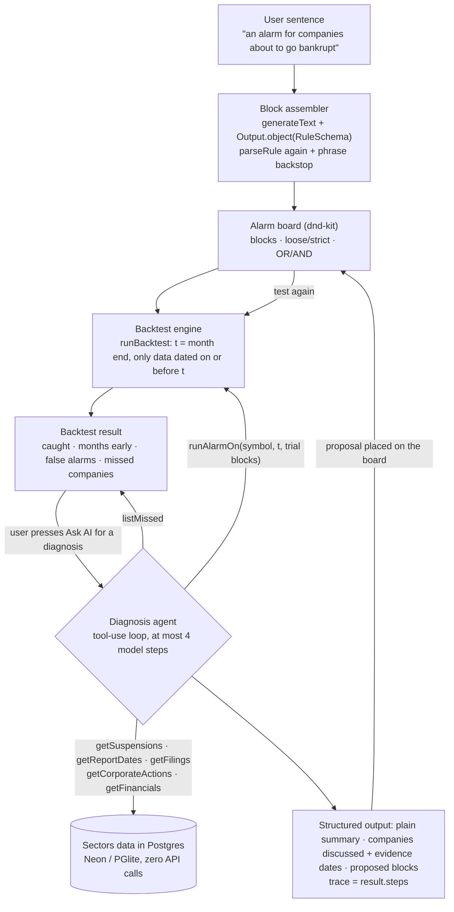
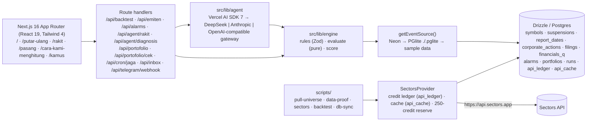

# Alarm Saham

[](https://github.com/fajaraji/alarm-saham/actions/workflows/ci.yml)

Alarm Saham lets ordinary Indonesian investors read the warning signs that the stock exchange has already published, and then **build their own alarm, test it against real cases from the past, and set it on their portfolio**. All market data comes from the [Sectors Financial API](https://sectors.app). Built for **Sectors Hackathon 2026, Track 01: AI Agents & Assistants**.

**Live app:** https://alarm-saham.vercel.app

> **Alarm Saham is an information and analysis tool, not investment advice.** It never places orders, never recommends buying or selling, and never judges whether any listed company is a good or bad holding. It shows official, dated facts with their sources, and stops there.

The app itself is in Indonesian, because its users are Indonesian retail investors. This README is in English.

## For judges: 60 seconds

- **Problem:** official warning signs (trading suspensions, quarterly reports that stop arriving, negative equity, dilutive rights issues) are published by the Indonesia Stock Exchange (IDX) long before a stock is delisted. Retail investors rarely read them in time.
- **What we built:** (1) **replay** the official warning signs of any stock on a time slider, (2) **assemble** an alarm from condition blocks and **backtest it** against 107 real companies, (3) **set** the alarm on a portfolio, with an automatic morning check and an in-app inbox.
- **The agent:** a custom tool-use loop (Vercel AI SDK 7) that investigates **why an alarm missed a specific company**, using 7 tools over the Sectors data in our database, then proposes blocks that would have caught it. The trace shown to users is built from the SDK's real tool calls, not from text the model wrote about itself.
- **Real, reproducible scores:** the default alarm catches **26 of 74** troubled companies, on average **9 months** before the event, with **1 false alarm in 30** healthy controls. Reproduced by `npm run backtest` and guarded by automated tests. Its limitations are written out in plain language on `/cara-kami-menghitung`.
- **Sectors is the core:** **395** of our 1,000 credits pulled the 107-company test universe into Postgres. Without Sectors there is no backtest and no portfolio check.
- **Verified in production (12 September 2026):** full 1-2-3 smoke test passes against the live URL; a real AI diagnosis returns HTTP 200 in 98.7 s with 53 real tool calls; a backtest over 104 companies answers in about 2 seconds.

## The problem, and who it is for

Our user is the retail investor who has been "stuck" in a stock: bought on a tip from a chat group, then watched the stock get suspended for months until it was removed from the exchange.

The facts behind this product, with sources:

- **18 companies are being delisted from the Indonesia Stock Exchange effective 10 November 2026**, with a company buyback window from 11 May to 9 November 2026. Seven because of bankruptcy (COWL, MTRA, SRIL, TOYS, SBAT, TDPM, TELE) and eleven because they had been suspended for more than 50 months (LCGP, SUGI, MABA, LMAS, SKYB, ENVY, GOLL, PLAS, TRIL, UNIT, DUCK). Source: [Bareksa, 13 April 2026](https://www.bareksa.com/berita/saham/2026-04-13/18-emiten-akan-dihapus-dari-bursa-efek-indonesia-mulai-10-november-2026-ini-daftarnya).
- **59 companies were on IDX's potential forced delisting list as of 30 June 2026** (announcement Peng-S-00019/BEI.PLP/06-2026): every one of them had been suspended for more than six months. Source: [Kontan](https://amp.kontan.co.id/news/bei-umumkan-59-emiten-berpotensi-delisting-paksa-dua-bumn-masuk-daftar). This list is our main scoring universe.
- **45,866 investors held Sritex (SRIL) shares** when the stock was declared for delisting, including one holder with more than 1% worth Rp30.56 billion. Source: [hargasaham.id](https://www.hargasaham.id/delisting-sritex-investor-terdampak-lo-kheng-hong/).

**Why it is urgent.** While the exchange suspends a stock, it cannot be sold on the exchange. A warning only helps before that point.

For many of these companies the official signs were already in the same data we now pull from Sectors, often more than a year earlier. Open `/putar-ulang?kode=TELE` and drag the time slider back.

**What existing tools already do, and the gap we fill.** IDX itself marks troubled stocks with special notation codes, and Indonesian retail apps already surface red flags and AI summaries. What none of them lets you do is **step 2: write your own alarm and test it against history** before trusting it. That is the core of this product.

## Why test an alarm against the past?

An alarm is set to watch the future. The question is whether the rule behind it is any good, and waiting for the future to find out means finding out after the money is already stuck.

So before you use a rule, the app runs it over companies whose outcome is already known: companies that were delisted or put on the potential delisting list, and healthy companies that were not. The test answers three questions:

1. Before those companies collapsed, would this rule have warned?
2. How many months earlier?
3. On healthy companies, does it warn when nothing was wrong?

For the default rule the answers are: it warned early on **26 of 74** troubled companies, **9 months** earlier on average, and it wrongly warned on **1 of 30** healthy companies. Before using it, you already know it misses about two cases in three but rarely raises a false alarm. You can add blocks and test again.

The past is used to check the rule. The future is where you use it. A rule that warned in time before is not guaranteed to warn in time again; testing reduces the guesswork, it does not remove it.

## What it does: three steps

| Step | Page | What happens |
|---|---|---|
| 1. Replay | `/putar-ulang?kode=TELE` | A timeline of one company's official signs (suspensions with IDX PDF links, missing quarterly reports, negative equity, rights issues) on a time slider. Every event names the Sectors endpoint it came from. Search suggests all **363** companies the server can show as you type. |
| 2. Assemble | `/rakit` | A drag-and-drop board (dnd-kit): 5 condition blocks, loose or strict thresholds, OR/AND. **Test against the past** scores caught / months early / false alarms per company. The AI panel can assemble blocks from a plain sentence, and explain on request why the alarm missed a company. |
| 3. Set and watch | `/pasang` | A portfolio behind a secret link, checked every morning against the database. New flags land in an in-app inbox (and Telegram, if a bot token is configured). |
| Methodology | `/cara-kami-menghitung` | Block definitions read from the engine's own constants, how scores are computed, the universe, anti-lookahead, honest limitations, the credit ledger, and per-company tables. |
| Glossary | `/kamus` | Every term explained in everyday language, with the same definitions used by the dotted-underline tooltips across the app. |

The homepage leads with a stock search: type the code of a stock you hold and see the official signs on record for it. Below that sits one real example, read from the database: TELE (PT Omni Inovasi Indonesia Tbk), scheduled for delisting effective 10 November 2026 after bankruptcy. At least eight signs were already on record well before then, the earliest being negative equity in September 2023; the timeline shows the latest four, including a trading suspension in December 2024.

## Why this is an agent, not just a prompt

Two AI capabilities live in `src/lib/agent/`. Both are tested with mock models, so `npm test` needs no API key.

1. **Block assembler** (`rakit.ts`): a plain sentence becomes `generateText` + `Output.object(RuleSchema)`, where `RuleSchema` is the **same** Zod schema the backtest engine uses. The result is re-validated with `parseRule` and checked by the phrase backstop. Off-topic requests are refused politely.
2. **Diagnosis agent** (`diagnosis.ts`, the core of this track): given a rule and its backtest result, the agent runs a tool-use loop and **decides for itself** which tools to call to explain why the alarm stayed silent for a given company. It can try extra blocks through the backtest engine, then proposes at most 2 blocks. The `trace` comes from `result.steps` (real tool calls), not from the model's text.



Tools available to the agent. All of them read the same `EventSource` as the backtest engine and none of them call Sectors.

| Tool | What it does |
|---|---|
| `listMissed` | Troubled companies this rule did not catch, prioritised to the ones the data can explain, plus the true total |
| `getSuspensions` | Every suspension of one company (date and exchange reason) |
| `getReportDates` | Quarterly reports available, and therefore which ones are missing |
| `getFilings` | Insider and institutional buy/sell filings |
| `getCorporateActions` | Rights issues: ex-date and new/old share ratio |
| `getFinancials` | Total equity per quarter |
| `runAlarmOn` | Run the engine (`fires`) for one company on one date with trial blocks |

**Built to survive a real deployment.** Three things only showed up once the agent ran against the real 104-company universe behind a web request, and each changed the code:

- **Step budget.** Wall-clock time is driven by model round trips, not tool calls (tools read local data in microseconds). We measured 4 steps / 10 tool calls = 169 s against 7 steps / 44 tool calls = 418 s, while a Vercel Hobby function stops at 300 s. The loop is capped at **4 steps**, and `listMissed` hands the model at most 8 explainable cases while stating the real total.
- **Two-phase calls through OpenAI-compatible gateways.** A gateway cannot enforce a JSON schema and a tool loop in the same call, so when `LLM_BASE_URL` is set the agent first explores with tools, then makes one small, tool-free call that only turns the findings into the schema. If the step budget runs out, phase 2 still answers from the trace already collected.
- **Diagnosis is on demand, not automatic.** Early on, every backtest also triggered a diagnosis. In production that meant roughly 55,000 to 66,000 tokens per click, and a busy gateway would show an AI error on every backtest even though the backtest itself succeeded in 2 seconds. Diagnosis now runs only when the user presses **Minta diagnosis AI**.

## Architecture



- **App:** Next.js 16.3 (App Router, Turbopack), React 19, TypeScript, Tailwind v4, dnd-kit. UI language: plain Indonesian.
- **AI:** Vercel AI SDK 7 (`ai`, `@ai-sdk/deepseek`, `@ai-sdk/anthropic`). No client is created at module scope; without a key, the AI endpoints answer 503 and the UI says the AI feature is not active while everything else keeps working.
- **Data layer:** one `DataProvider` interface with two implementations. `SectorsProvider` calls the real API and records **every call in a credit ledger**, caches historical data permanently (daily data by TTL, 404s for 30 days), and **refuses new calls when fewer than 250 credits remain** unless `ALLOW_RESERVE=1`. `FixtureProvider` reads a small JSON sample. **Every backtest runs from the database, never from the API.**
- **Database:** Drizzle ORM + Postgres. Production uses Neon. Without `DATABASE_URL`, scripts and pages fall back to **PGlite** (real Postgres compiled to WASM) in `./.pglite` with the same migrations. `npm run db:sync -- --from=pglite --to=neon` copies every table at zero credit cost.
- **Backtest engine** (`src/lib/engine`): `fires(rule, events, t)` is a pure function that only sees rows dated on or before `t`; `runBacktest` scans every month end and produces a deterministic score. Assumptions are in `docs/mesin-uji.md`.
- **Hosting:** Vercel. Functions run in `sin1` (Singapore), the same region as the Neon database (`ap-southeast-1`). On the default region (`iad1`, Washington D.C.) a backtest took 27 seconds; in `sin1` it takes about 2, with identical results.
- **Secrets:** keys live only in `.env.local` (git-ignored) and are never printed to logs. A pre-commit hook (`scripts/check-secrets.mjs`) rejects commits containing key patterns, and `npm run scan:history` scans **the entire git history** in CI, because a local hook can be skipped with `--no-verify` and a committed key stays readable in a public repository's history.
- **Public endpoint limits:** every route that can spend Sectors credits or LLM balance is rate-limited (`src/lib/api/pagar.ts`). The bucket key is chosen by the server from the proxy's client IP, not from the browser-generated owner token, so a fresh token per request does not mean a fresh quota. Class B checks (which spend Sectors credits) require the owner's secret link, allow at most 10 stocks per check, and run only when a database exists so every credit is recorded.

## Sectors endpoints used, and why

Each endpoint's data depth was proven on 6 companies first (`docs/data-proof.md`) before pulling the universe (`docs/universe-pull.md`). The last column is the universe pull according to `api_ledger`; 68 data-proof credits came before it.

| Endpoint | Used for | Why this endpoint | Credits |
|---|---|---|---|
| `/v2/suspensions/` (exchange-wide feed) | **Suspended** block; target event dates for every troubled company; filtering controls (no suspensions) | The only source of suspension *history*. Per symbol it returns only the latest suspension; the feed holds 583 events since 2018-12-28 | 20 |
| `/v2/company/get_quarterly_financial_dates/{symbol}/` | **Missing reports** block; choosing `n_quarters` for financials | Available quarters since 2020 Q1; the list only grows, so it is lookahead-free | 101 (incl. 8 × 404) |
| `/v2/company/corporate-actions/{symbol}/` | **Dilutive corporate action** block (rights issue `ex_date`, new/old ratio) | The only source of rights issues with their ratio; depth back to 2016 | 93 |
| `/v2/financials/quarterly/{symbol}/` | **Debt exceeds assets** block (`total_equity < 0`) | Quarterly equity. **1 credit per quarter**, so only for the 18 delisted companies, with `n_quarters` taken from `dates` to avoid paying for empty quarters | 91 |
| `/v2/filings/?symbol=` | **Insiders selling** block | The only insider transaction feed. **Data starts in 2024**, so this block is labelled "limited" | 89 |
| `/v2/companies/?where=indices in ['LQ45']` | Picking 30 healthy controls | Official LQ45 membership. It returns no market cap and rejects `order_by`, so controls are the first 30 alphabetically (explained on the methodology page) | 1 |
| `/v2/free-float/` | Company names; class B **small free float** block (set mode) | Exchange-wide snapshot; no history, so never part of the backtest | 0 (cached) |
| `/v2/broker-summary/{symbol}/`, `/v2/daily/{symbol}/` | Class B **retail dominance** and **fall from 90-day peak** (set mode) | Current data in 14/90-day windows; not part of the backtest | 4 (one real class B test) |
| `/v2/listing-performance/{symbol}/` | *Tried*, then **removed** | 404 for 5 of 6 test companies and no listing date; 404s are still billed | n/a |

## Measured results

### Backtest score (snapshot 2026-09-07)

Default rule "Suspension watch" = suspended (loose) OR missing reports (loose) OR negative equity (loose); scanned at every month end from 2020-01-31 to 2026-09-07.

The target event is **the day the stock stopped trading**, that is the earliest suspension that is not a price-movement halt, because after that day a retail holder can no longer sell. Suspensions announced for a price surge ("cooling down", 460 of 583 rows in our data) are not treated as a sign of a troubled company.

| Measure | Value |
|---|---|
| Caught (troubled companies) | **16/71**: delisted 4/17, potential delisting 12/54 |
| Months early (events from 2021 onward) | median **2 months**, mean 7.6 (three companies that stopped reporting for years drag the mean up: FIMP 42, BIMA 33, DPNS 18) |
| False alarms | **1/30** healthy controls (AADI, a limitation of our definition, explained on the methodology page) |
| Skipped | 6 troubled companies whose trading-halt date we do not know (ENVY, MENN, PTMR, TGRA, TGUK, WSKT) |

Most catches are one repeatable pattern: the annual report is not filed by 30 April, and the exchange suspends the stock around the end of June (ZBRA, ALTO, SWAT, PMMP). Why the rest were missed, how controls were chosen, anti-lookahead, and every data limitation (reports since 2020 Q1, filings since 2024, 8 companies returning 404, one suspension row per symbol, free float without history, survivorship) are on **`/cara-kami-menghitung`**.

### Production (Vercel + Neon, 12 September 2026)

| Check | Result |
|---|---|
| Data source | `data-sumber="db"` on every page, reading Neon (not sample data) |
| Backtest over 104 companies | 27.1 / 28.3 / 26.4 s in `iad1` → **2.9 / 1.9 / 1.8 s** in `sin1`, same result |
| AI diagnosis | **HTTP 200 in 98.7 s**, 5 model steps, 53 tool calls, 66,428 tokens, no flagged phrases |
| Diagnosis through the gateway, measured separately | 4/4 successful at 71 to 238 s with `deepseek-v4-flash` |
| Playwright smoke test (steps 1 → 2 → 3) against the live URL | **passed**, zero console errors, zero Sectors credits |
| Morning cron | `/api/cron/jaga` registered and enabled in the Vercel dashboard |

Model choice is a measured decision, not a preference. On the same gateway and the same schema, `deepseek-v4-flash` succeeded 6 times out of 6, while `deepseek-v4-pro` failed 6 times out of 6 with gateway capacity errors. Details in `docs/decisions.md`.

## Running it locally

Requirements: Node.js 24 and npm 11.

```bash
git clone https://github.com/fajaraji/alarm-saham.git
cd alarm-saham
npm ci
cp .env.example .env.local     # PowerShell: Copy-Item .env.example .env.local
npm test                       # no keys, no network
npm run dev                    # http://localhost:3000
```

Three levels, depending on what you have:

1. **No keys at all:** every page runs on **sample data for 8 companies**, and every screen that shows numbers labels them `data contoh` (sample data) so no number can be mistaken for official data. `/cara-kami-menghitung` still shows the real scores from the committed snapshot. The AI endpoints answer 503 and the UI says so.
2. **With `SECTORS_API_KEY`:** build a local PGlite database. Our real run cost **395 credits** (a `--dry` estimate from an empty cache is about 417). It is idempotent, so a second run costs 0.
   ```bash
   npm run pull-universe -- --dry --pglite
   npm run pull-universe -- --pglite
   ```
   After that, `/putar-ulang`, **Test against the past** on `/rakit`, `/pasang`, and `npm run backtest` all use the 107 real companies through one entry point, `getEventSource()` (Neon → PGlite → sample data).
3. **With `DATABASE_URL` (Neon):** run `npm run db:migrate`, then `npm run db:sync -- --from=pglite --to=neon`. Add an LLM key (see [AI configuration](#ai-configuration)) to enable the assembler and the diagnosis agent.

## Tests and verification

Numbers from the development machine, 13 September 2026:

| Gate | Result |
|---|---|
| `npm run lint` · `npm run typecheck` · `npm run build` | exit 0 |
| `npm test` (Vitest, unit + PGlite integration) | **685 tests in 62 files** |
| `npm run test:e2e`, database path (the deployed shape) | **53 passed**, 1 skipped (a sample-data-only spec) |
| `E2E_TANPA_PGLITE=1 npm run test:e2e`, sample-data path | **51 passed**, 3 skipped (real-data-only specs) |
| `npm run scan:history` | 0 findings |

CI runs lint, typecheck, unit tests, build, history scan, **and both e2e variants** on every push. The e2e suite includes axe-core accessibility checks (WCAG AA) in **both light and dark mode**. Those checks have caught real regressions, including a colour-contrast failure caused by an entrance animation, which was removed.

```bash
# database path, exactly what the CI e2e-db job runs
npm run e2e:seed -- --dir=.pglite-e2e --paksa   # rebuild the e2e DB from the committed seed, zero API calls
E2E_PGLITE_DIR=.pglite-e2e npm run test:e2e

# sample-data path
E2E_TANPA_PGLITE=1 npm run test:e2e

# smoke test against a live deployment
E2E_BASE_URL=https://alarm-saham.vercel.app E2E_SUMBER=db E2E_AI=aktif npx playwright test tests/e2e/smoke.spec.ts
```

The seed `tests/e2e/seed/universe-uji.json` (under 1 MB, committed) holds **real** class A rows from the Sectors pull: 107 companies, suspensions, report dates, corporate actions, financials, and filings, with no credit ledger, cache, or user data. `npm run e2e:seed` refuses to overwrite an existing folder unless you pass `--paksa`. Refresh it when the seed changes, otherwise local e2e can pass while CI fails.

**Clean-clone check.** On 10 September 2026 we cloned the repository into a temporary folder on Windows 11 with no `.env.local`, no `./.pglite`, and no keys. `npm ci`, `npm test`, `npm run e2e:seed`, the database-path e2e suite, both backtest commands, and `npm run scan:history` all exited 0. Test counts have grown since; that clean-clone run has not been repeated.

## Reproducing the score

The backtest engine never calls the API. Its source is `DATABASE_URL`, then `./.pglite`, then the sample data.

```bash
# Small sample of 8 companies (always works, no data needed)
npm run backtest -- src/lib/engine/fixtures/aturan-default.json --fixture --today=2026-09-07

# Real universe of 107 companies (needs ./.pglite or DATABASE_URL)
npm run backtest -- src/lib/engine/fixtures/aturan-default.json --today=2026-09-07
#   → caught 16/71 (delisted 4/17, potential delisting 12/54), median 2 months, mean 7.6, false alarms 1/30

# The committed snapshot (docs/skor-nyata.json) is produced by
npm run backtest -- src/lib/engine/fixtures/aturan-default.json --today=2026-09-07 --json
```

`tests/unit/docs/skor-nyata.test.ts` recomputes the score from `./.pglite` and requires both the summary **and** the per-company detail to match the snapshot. Other rules can be written as JSON `{ name, combine: "any"|"all", blocks: [{ kind, threshold }] }` with `kind` in `suspensi | laporan_hilang | aksi_dilutif | ekuitas_negatif | insider_jual` and `threshold` in `longgar | ketat`.

## Deploying to Vercel

Order matters: **set the environment, migrate, copy the data, then deploy**. Otherwise the app goes live with no data.

1. **Import the GitHub repository** into Vercel. If Vercel offers a Neon integration during import, skip it when you already have a Neon database: it provisions a new, empty database and injects its own `DATABASE_URL`.
2. **Set environment variables** (Project → Settings → Environment Variables). Full explanations are in `.env.example`.

   | Variable | Required? | If empty |
   |---|---|---|
   | `SECTORS_API_KEY` | for pulling data and class B blocks | no new data; pages still run from what is already in the database |
   | `DATABASE_URL` (Neon, pooled) | **yes** | production serves **sample data for 8 companies** (labelled as such), portfolios cannot be saved |
   | `LLM_BASE_URL` + `LLM_API_KEY` + `LLM_MODEL` (+ `LLM_MODEL_RINGAN`) | for AI, via an OpenAI-compatible gateway | AI endpoints answer 503; the rest of the product works |
   | or `DEEPSEEK_API_KEY` / `ANTHROPIC_API_KEY` | for AI, direct to the provider | same as above |
   | `CRON_SECRET` (16+ random characters) | for the morning check | `/api/cron/jaga` answers 503; the endpoint is never open without it |
   | `TELEGRAM_BOT_TOKEN` + `TELEGRAM_WEBHOOK_SECRET` | optional | notifications still arrive in the in-app inbox on `/pasang` |

   Leave the development-only variables in section 3 of `.env.example` (such as `ALARM_HARI_INI`, `TANPA_PGLITE`, `SECTORS_BASE_URL`) **empty** in production.
3. **Prepare Neon** and move the data you already pulled, at zero credit cost:
   ```bash
   npm run db:migrate
   npm run db:sync -- --from=pglite --to=neon
   ```
4. **Deploy.** `vercel.json` pins functions to `sin1` and registers the cron job. If you set a Telegram token, register the webhook once:
   ```bash
   npm run telegram:set-webhook -- https://<app>.vercel.app
   ```
5. **Check after deploying:** every page should carry `data-sumber="db"`, and `/putar-ulang?kode=TELE` should show Sectors as the source, not sample data. Then run the live smoke test above.

## Morning check and notifications

- `vercel.json` schedules Vercel Cron `30 23 * * *` (UTC), which is **06:30 WIB**, calling `GET /api/cron/jaga` with `Authorization: Bearer <CRON_SECRET>`. Without `CRON_SECRET` the endpoint answers 503; a wrong header answers 401. On the Hobby plan, Vercel gives cron jobs a flexible 1-hour window.
- The cron evaluates **class A blocks only** (zero Sectors credits) for every portfolio with an active alarm, compares against the last run, and sends **only new flags**. A second call on the same day produces 0 messages, so duplicate deliveries are harmless.
- Notifications always go to the **in-app inbox** (`/api/inbox`, shown on `/pasang`). If `TELEGRAM_BOT_TOKEN` is set, flags are also sent to any Telegram chat linked with `/mulai <portfolio-code>`; `/berhenti` unlinks it. The Telegram path is covered by tests with a mocked Telegram API; it has not been verified against a real chat.

## AI configuration

Set **one** of these in `.env.local`:

| Route | Variables | Notes |
|---|---|---|
| **OpenAI-compatible gateway** (our production setup) | `LLM_BASE_URL`, `LLM_API_KEY`, `LLM_MODEL`, optional `LLM_MODEL_RINGAN` | One key, many models. We run `deepseek-v4-flash` through Kagiro. Enables the two-phase diagnosis automatically. |
| DeepSeek direct | `DEEPSEEK_API_KEY` | `deepseek-v4-flash` by default; `DEEPSEEK_REASONER=1` switches reasoning to `deepseek-v4-pro` |
| Anthropic | `ANTHROPIC_API_KEY` | `claude-opus-5` for reasoning, `claude-sonnet-5` for light tasks, with adaptive thinking and prompt caching |

`LLM_PROVIDER=deepseek|anthropic` forces a provider. The legacy aliases `deepseek-chat` and `deepseek-reasoner` were retired by DeepSeek on 24 July 2026.

**Choose a fast model for the web path.** A Vercel Hobby function stops at 300 seconds, and a diagnosis needs several model round trips. On the gateway we use, the faster model was both quicker and more available than the larger one (see [Measured results](#measured-results)). The diagnosis summary step always uses the light model (`LLM_MODEL_RINGAN`), because it only formats findings that already exist.

**Cost.** One diagnosis over the full 104-company universe measured about 50,000 to 66,000 tokens; one block assembly is far smaller. Real token usage is returned in the `usage` field of every response. Price per token depends on your provider.

## Competition rules and compliance

- **Sectors data is the core.** Without it there is no backtest and no portfolio check. Every call is recorded in the credit ledger: **467** of 1,000 credits used (395 universe pull + 68 data proof + 4 real class B test), **533** remaining, with 250 held in reserve that the code will not spend. These numbers are not typed by hand: `npm run kredit:snapshot -- --pglite` reads them from `api_ledger` into `docs/kredit-ledger.json`, and the methodology page, this README, and `tests/unit/docs/kredit-ledger.test.ts` all derive from that file. Running the app and its backtests costs zero credits. A refresh on 20 September 2026 spent 98 more credits against the production database (3 for the suspension feed up to that day, 95 for quarterly report dates, stalest companies first) through `npm run segarkan`, which prints the ledger before and after so the cost is measured rather than estimated.
- **Custom agent logic:** a tool-use loop plus structured output over our own backtest engine, not a wrapped prompt.
- **No order execution.** There is no buy or sell action anywhere in the app, and no code path that can place an order.
- **Not investment advice.** A disclaimer sits in the footer of every screen and in the agent's system prompt. Real companies are mentioned only with official facts and source links. When the server runs on sample data, every screen says so, and no event is attributed to Sectors.

### How AI output is kept from becoming investment advice, and where that stops

We do **not** claim a filter that blocks every piece of advice. An earlier version of this document made that claim, and it was **wrong**: on 2026-09-10 two adversarial reviewers wrote 65 pieces of investment advice and 60 passed through without a single flag, while the same filter destroyed 41 of 83 legitimate sentences. A regular expression cannot tell whether the subject of an Indonesian sentence is the user's portfolio or the alarm's configuration. So the job is split into three layers, in order of importance:

| Layer | What enforces it | Strength | Limit |
|---|---|---|---|
| 1. **System instructions** (primary control) | `src/lib/agent/instructions.ts` forbids the whole subject matter (positions, allocation, lots, funds, timing of trades, price judgements), states separately what the agent *should* do, and gives paired negative examples | Covers endless variants: affixes, typos, slang, disclaimers placed in front | Depends on model compliance; cannot be proven deterministically |
| 2. **Structured output** | Block `kind` and `threshold` are enums, evidence is dates, prose fields are narrow; proposals arrive as data, not paragraphs | The model has nowhere to hide a trading instruction | Prose fields (`ringkasan`, `sebab`, `alasan`) remain free text |
| 3. **Phrase backstop** | `src/lib/agent/guard.ts` + `FRASA_BACKSTOP`: 26 phrases that cannot mean anything else in this domain ("cut loss", "take profit", "target harga", "average down") | High precision; tolerates hyphens and double spaces | **Low recall by design; does NOT guarantee every piece of advice is caught** |

Measured on `tests/fixtures/korpus-anjuran.json` (106 legitimate sentences + 101 pieces of advice, verbatim from both reviewers), measured 2026-09-10 with `node --import tsx scripts/ukur-penjaga.ts` and reprinted on every `npm test`:

| | Before the redesign (`72a33ca`) | After |
|---|---|---|
| Precision: legitimate sentences left unchanged | 66/106 = 62.3% | **106/106 = 100%** |
| Recall: advice flagged | 77/101 = 76.2% | 56/101 = 55.4% |
| Legitimate sentences destroyed | 40 | **0** |
| Advice written by the reviewers that is now caught | 1/25 | **11/25** |

We **chose precision**: the test gate fails if a single legitimate sentence changes, but never because recall is low. What we accept by making that choice, stated plainly: the bare words "beli"/"jual" (buy/sell) are not filtered because they collide with factual sentences such as "net retail buy volume 81%"; "harga wajar" (fair price) is not filtered because it collides with our own refusal "we never compute a fair price"; "akan naik" (will rise) is not filtered because it collides with backtest output such as "findings will rise from 26 to 41"; slang and typos are not chased; and ticker codes are not normalised, so "Hindari SRIL" (avoid SRIL) passes.

Two behaviours changed because the reviewers proved their cost:

- The backstop **redacts the phrase, it does not delete the sentence**, so the numbers and dates in the same sentence survive.
- A proposed block's reason is **never cut**. If the backstop fires there, the text stays intact and the proposal gets a visible warning, because a block proposal without a reason deletes the very value of the feature. The morning check is stricter: its deterministic template already carries every fact, so if the backstop fires on the model's rewording, the rewording is discarded and the template is sent.

## Honest status

**Done, tested, and live:** all three steps, the backtest engine, the 107-company universe (395 credits, re-run costs 0), the diagnosis agent and block assembler verified with a real model in production, the data layer with credit ledger and cache, the daily cron, in-app notifications, the guided overlay, glossary and disclaimers on every screen, WCAG AA contrast in both themes, public endpoint limits, honest source labels, full-history secret scanning in CI, and the production deployment on Vercel + Neon.

**Not done, and not claimed:**

- **Sharing an alarm by link** (ticket 17) is in the backlog.
- **Telegram delivery to a real chat** has not been verified; all Telegram evidence comes from mocked tests.
- **Cross-instance rate limiting.** Limits live in each instance's memory. The real protection on credits is the credit ledger plus the 250-credit reserve.
- **A filter that catches all investment advice** does not exist here (see above).
- **Backtest coverage before 2020.** Report data starts in 2020 Q1, which is why 12 of 18 delisted companies are missed: their target events fall between 2018 and 2021.

After submission, the repository and the app are **frozen** (no further commits) and remain public for at least 90 days.

## Commands

| Command | Purpose |
|---|---|
| `npm run dev` | development server |
| `npm run lint` · `npm run typecheck` | ESLint · TypeScript |
| `npm test` | Vitest (unit + in-memory PGlite integration) |
| `npm run test:e2e` · `E2E_TANPA_PGLITE=1 npm run test:e2e` | Playwright on a local production build: database path (port 3100) and sample-data path (port 3101). CI runs **both** |
| `npm run e2e:seed -- --dir=.pglite-e2e [--paksa]` | build the e2e database from the committed seed (zero API calls) |
| `npm run e2e:export-seed -- --pglite` | re-export that seed from `./.pglite` |
| `npm run scan:history` | scan the whole git history for key and credential patterns (no dependencies, used by CI) |
| `npm run build` | production build |
| `npm run backtest -- <rule.json> [--fixture] [--pglite[=dir]] [--json] [--today=YYYY-MM-DD]` | backtest from DB, PGlite, or sample data; zero API calls |
| `npm run pull-universe -- [--dry] [--pglite]` | pull the test universe into the database (needs `SECTORS_API_KEY`; `--dry` makes no API calls) |
| `npm run data-proof -- [--dry]` | data-depth proof on 6 companies |
| `npm run sectors -- <endpoint> <symbol>` | one Sectors call through the provider (ledger + cache) |
| `npm run db:migrate` · `npm run db:sync -- --from=pglite --to=neon` | Drizzle migration · copy PGlite to Neon at zero credit cost |
| `npm run kredit:snapshot -- --pglite` | write the credit ledger snapshot to `docs/kredit-ledger.json` |
| `npm run agent:demo -- tele` | a real diagnosis from the command line (needs an LLM key, costs tokens) |
| `node --import tsx scripts/ukur-penjaga.ts [--rinci]` | measure the phrase backstop's precision and recall (no API, no keys) |
| `npm run telegram:set-webhook -- https://<app>` | register the Telegram webhook once after deploying |

## Documents

- `PLAN.md`: the execution contract (decisions, blocks, scoring, architecture, credit budget, fallback rules).
- `docs/decisions.md`: dated decision log, including every production measurement quoted above.
- `docs/data-proof.md`: data depth per endpoint, block decisions, first real score.
- `docs/universe-pull.md`: the 107-company pull, credits per step, controls, path to Neon.
- `docs/mesin-uji.md`: backtest engine assumptions.
- `docs/skor-nyata.json` · `docs/kredit-ledger.json` · `docs/penjaga-frasa.json`: committed snapshots that the app, this README, and the tests all read.
- `tests/fixtures/korpus-anjuran.json`: the benchmark for the advice guard.
- `DESIGN.md`: the design direction (palette, type, contrast rules), transcribed from the implemented system.
- `anti-slop/`: the UI and copy audit and its follow-up report.
- `tickets/`: status of every ticket, with verification evidence.

---

**Alarm Saham is an information and analysis tool, not investment advice. No buy or sell recommendations, no order execution, and no judgement about any listed company.**
